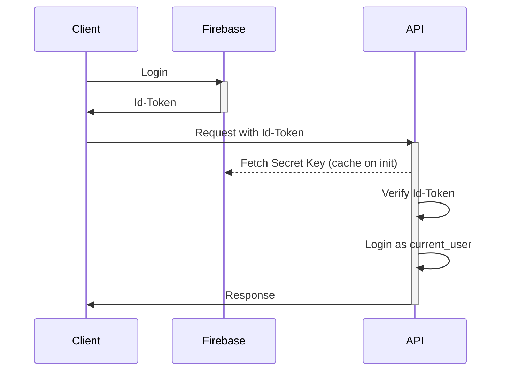

# 認証・認可の設計

## 概要

re-music 内での認証・認可機能の設計を行う

## 要件

- なるべくユーザ情報を独自に管理する必要の無い構造を取る
- クライアントアプリとしては、Web と Mobile を想定する。両方のクライアントアプリで容易に認証サーバにアクセスできるような構成を考える

## 設計案 1

認証機能は、Firebase Auth を利用して実装する。クライアントアプリから Firebase に対して、ログイン操作を実行し、発効された Id-Token 付きのリクエストを API に送ることで、認証済みのユーザか API 側で判定する。

## 認証シーケンス

## トークンの検証

トークンの検証では、下記の項目を検証する。

- トークンが改竄されていないこと
- トークンの有効期限が切れていないこと

## API の認可処理

トークンから UID を取得し、それに紐づくユーザにログインした状態として認識する。ユーザ所有のデータは、常にユーザ ID を持ち、データの CRUD 処理ではユーザ自身のデータのみに対して実行することができる。

## トークンのリフレッシュサイクル

トークンのリフレッシュは、クライアントアプリで以下のイベントを検知した時に実施する。

- API からステータスコード 403 が返ってきた

## メリット

- ユーザ情報を独自に管理する必要がない
- Firebase のログイン処理は、各種のクライアントアプリから利用しやすい
- スケーラブルな構成である

## デメリット

- 再ログインのフローが手間

## 検討ポイント

- クライアントアプリで、ID トークンをどこに保持するか
  - Cookie
  - localStorage
- ユーザコミュニケーション
  - ユーザからの問い合わせに対しての対応フロー
- ユーザの有効化フロー
- パスワードのリセット等のフロー
