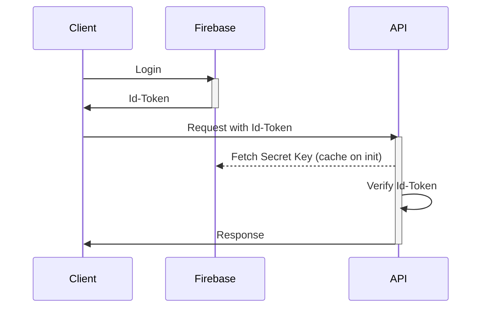

# 認証・認可の設計

## 概要

re-music 内での認証・認可機能の設計を行う

## 要件

- なるべくユーザ情報を独自に管理する必要の無い構造を取る
- クライアントアプリとしては、Web と Mobile を想定する。両方のクライアントアプリで容易に認証サーバにアクセスできるような構成を考える

## 設計案 1

認証機能は、Firebase Auth を利用して実装する。クライアントアプリから Firebase に対して、ログイン操作を実行し、発効された Id-Token 付きのリクエストを API に送ることで、認証済みのユーザか API 側で判定する。

## 認証シーケンス

## トークンの検証

トークンの検証では、下記の項目を検証する。

- トークンが改竄されていないこと
- トークンの有効期限が切れていないこと

## トークンのリフレッシュサイクル

トークンのリフレッシュは、クライアントアプリで以下のイベントを検知した時に実施する。

- API からステータスコード 403 が返ってきた

## 課題

- 再ログインのフローが手間
