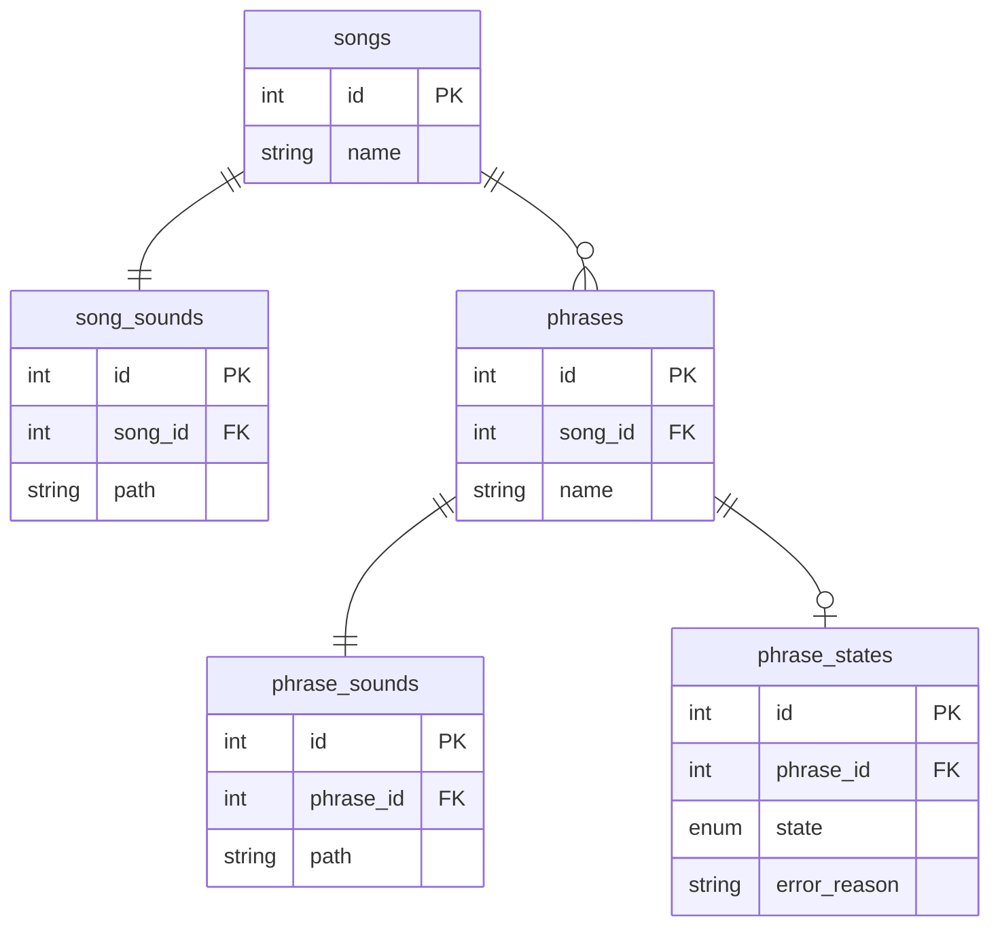

# ER 図

## リレーション

```mermaid
erDiagram

songs ||--|| song_sounds: ""
songs ||--o{ phrases: ""
phrases ||--|| phrase_sounds: ""
phrases ||--o| phrase_states: ""

songs {
  int id PK
  string name
}

song_sounds {
  int id PK
  int song_id FK
  string path
}

phrases {
  int id PK
  int song_id FK
  string name
}

phrase_sounds {
  int id PK
  int phrase_id FK
  string path
}

phrase_states {
  int id PK
  int phrase_id FK
  enum state
  string error_reason
}
```
