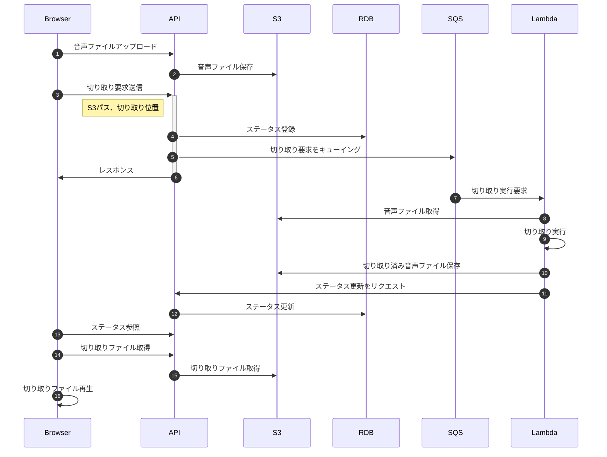

# メインフロー

音声ファイルの録音->トリミング->再生までのメインの処理フローを設計する。

## 要検討

- S3 へのアクセスは、Browser から直接ではなく API を経由した方が単純かもしれない
  - 将来的に、モバイルアプリとかを考えると API 側に諸々寄せておいた方が都合が良さそう
  - ただ、大きな静的ファイルをサーバ内で処理するのは、負荷的な面で心配
    - 初期スコープでは、API を経由する方に寄せる
- ユーザ管理は、初期スコープに入れるか？
